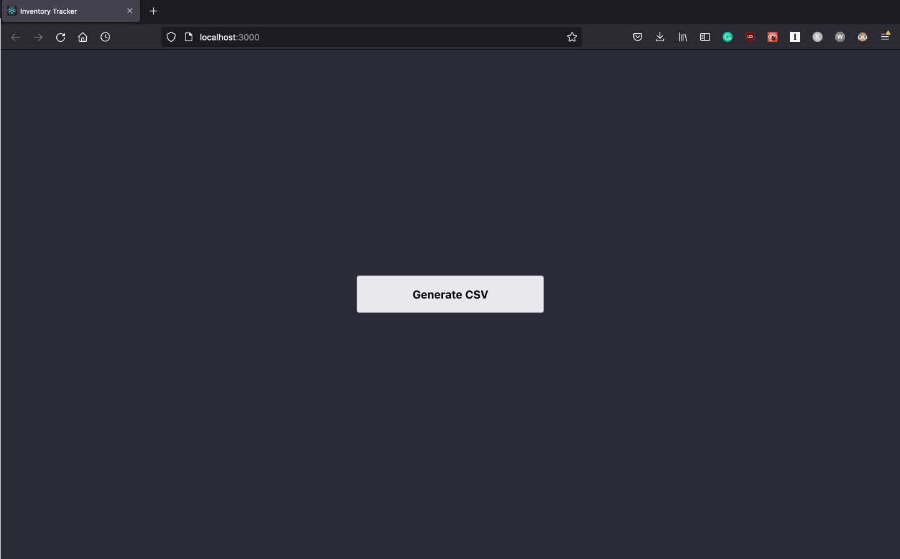
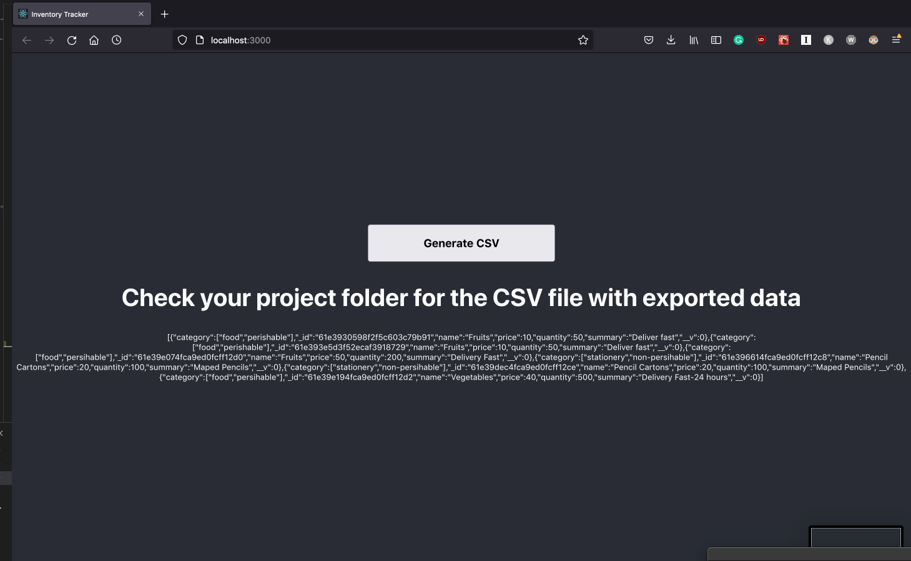
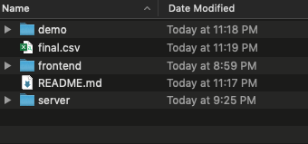
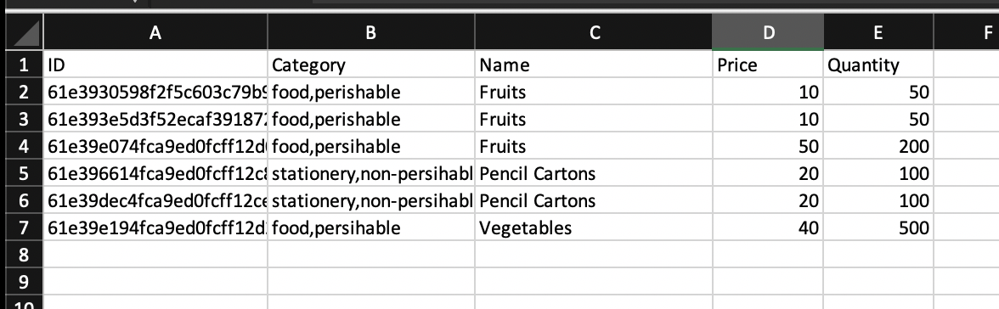
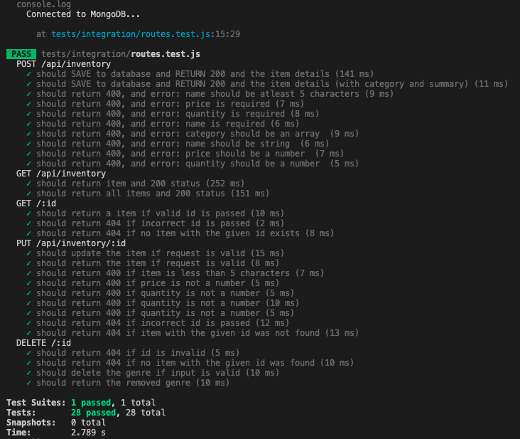

# InventoryTracker

## Requirements addressed
- Basic CRUD Functionality
    - Create inventory items
    - Edit Them
    - Delete Them
    - View a list of them

- Push a button export product data to a CSV

## How To Run The Project
- **Pre-req:** Make sure latest stable version of [node.js](https://nodejs.org/en/download/) is installed on your computer
- Clone repository and go into the application's directory
- **Backend:**
    - Navigate to the `server` folder
    - `npm install --save`
    - `nodemon server.js`
    - You can make CRUD requests on `http://localhost:5000`
- **Frontend:**
    - Navigate to the `frontend` folder
    - `npm install --save`
    - npm start
    - You can view the front end on `http://localhost:3000`
    - Click the button to export product data to a CSV
    - Find the `final.csv` file in the root directory to view product data
- **Testing:**
    - Navigate to the `server` folder
    - `npm install --save` (in the case this is not done before or if there are any issues with doing the next few steps)
    - `npx jest`
-**Important:** 
    - Make sure you run `npm install --save` when navigating to both folders for the first time. 
    - Make sure you have the latest stable version of node.js for both folders 

## End Points 
- **GET /api/inventory/** *returns a list of items*
- **GET /api/inventory/csv** *returns a list of items and creates a csv file in the root directory*
- **GET /api/inventory/:id** *returns information of a singular item*
- **POST /api/inventory/**  *creates new item and adds it to database*
- **PUT /api/inventory/:id** *edits existing item*
- **DELETE /api/inventory/:id** *deletes an item from the database*

## Front End Demo

The front end essentially helps address the second requirement of the challenge. It has a button which when clicked will trigger the GET /api/inventory/csv request and save a CSV file with product data






## Example HTTP Requests and Responses
```
request: POST localhost:5000/api/inventory/

request body:
{
    "category": [
        "food",
        "perishable"
    ],
    "name": "Fruits",
    "price": 10,
    "quantity": 50,
    "summary": "Deliver fast"
}

response body: 
{
    "category": [
        "food",
        "perishable"
    ],
    "_id": "61e394ea4fca9ed0fcff12c3",
    "name": "Fruits",
    "price": 10,
    "quantity": 50,
    "summary": "Deliver fast",
    "__v": 0
}
```

```
request: PUT localhost:5000/api/inventory/61e394ea4fca9ed0fcff12c3

request body:
{
    "category": [
        "food",
        "perishable"
    ],
    "name": "Vegetables",
    "price": 20,
    "quantity": 60,
    "summary": "Deliver fast- 24 hours"
}

response body: 
{
    "category": [
        "food",
        "perishable"
    ],
    "_id": "61e394ea4fca9ed0fcff12c3",
    "name": "Vegetables",
    "price": 20,
    "quantity": 60,
    "summary": "Deliver fast- 24 hours",
    "__v": 0
}
```

```
request: DELETE localhost:5000/api/inventory/61e394ea4fca9ed0fcff12c3

response body: 
{
    "category": [
        "food",
        "perishable"
    ],
    "_id": "61e394ea4fca9ed0fcff12c3",
    "name": "Vegetables",
    "price": 20,
    "quantity": 60,
    "summary": "Deliver fast- 24 hours",
    "__v": 0
}
```

```
request: GET localhost:5000/api/inventory/61e396614fca9ed0fcff12c8 


response body: 
{
    "category": [
        "stationery",
        "non-persihable"
    ],
    "_id": "61e396614fca9ed0fcff12c8",
    "name": "Pencil Cartons",
    "price": 20,
    "quantity": 100,
    "summary": "Maped Pencils",
    "__v": 0
}
```

```
request: GET localhost:5000/api/inventory/ 
alternative request: GET localhost:5000/api/inventory/csv


response body: 
{
    "category": [
        "stationery",
        "non-persihable"
    ],
    "_id": "61e396614fca9ed0fcff12c8",
    "name": "Pencil Cartons",
    "price": 20,
    "quantity": 100,
    "summary": "Maped Pencils",
    "__v": 0 
},
{...{....}....} : contains rest of items
```

### Testing ###

I have written 28 integration tests for this application and they cover all the aforementioned requests. The test results will appear in this manner after following mentioned instructions



## Technologies used**
- MongoDB
- Node.JS
- Javascript
- React
- Express.js
- Jest (Testing)

**Known Improvements**
There is a relatively minor issue when executing the test library where running `npx jest --detectOpenHandles` will reveal `mongoose.connect` is causing issues with the exiting of Jest. I have tried my best to solve this issue but all the recommended practices haven't brought any changes. However this doesnt affect with testing the application because the test suite is successfully run anytime it is launched! 
